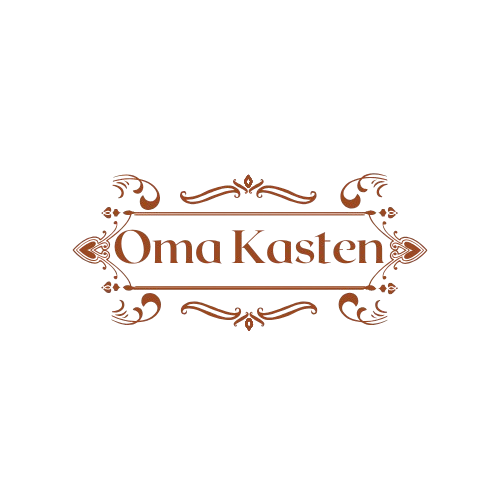

# 🏠 Oma Kasten - Sistema de Gestão e E-commerce

Sistema completo de gestão de produtos e pedidos para **Oma Kasten**, incluindo:

- Painel administrativo (CRUD de produtos, contatos, login de admin)
- Tela de cadastro e listagem de produtos para clientes
- Página de contato com envio para o banco de dados
- Integração com MySQL via PHP
- Frontend moderno usando HTML, CSS e JavaScript

---

## 💻 Tecnologias utilizadas

| Tecnologia | Logo | Descrição |
|------------|------|-----------|
| PHP |  | Linguagem de backend para comunicação com o banco de dados e lógica do servidor |
| MySQL |  | Banco de dados relacional usado para armazenar produtos, contatos e usuários |
| XAMPP |  | Servidor local que inclui Apache, PHP e MySQL |
| HTML / CSS / JS |  | Estrutura e estilo das páginas, com interações dinâmicas via JS |

---

## 🚀 Pré-requisitos

1. **XAMPP** instalado no seu computador  
   Baixe em: [https://www.apachefriends.org/pt_br/index.html](https://www.apachefriends.org/pt_br/index.html)

2. **Banco de dados MySQL** dentro do XAMPP

3. Pasta do projeto dentro do diretório do servidor, geralmente:

